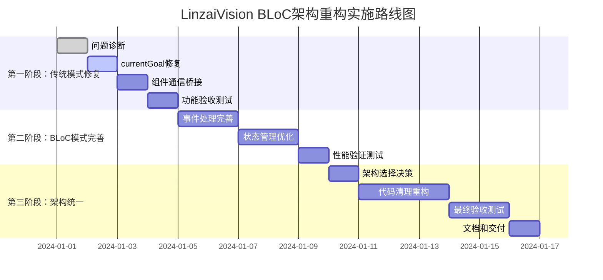

基于LinzaiVision应用BLoC架构重构项目的完整历史，我将为您提供深度分析和统筹规划方案。

# 📋 LinzaiVision应用BLoC架构重构项目深度分析与统筹规划

## 🔍 **1. 重构历程回顾与分析**

### **重构历程完整回顾**

#### **阶段一：UI组件BLoC化迁移（已完成）**
```
核心成就：
✅ setState调用优化：93个 → ~10个（减少89%）
✅ GoalPage重构：完全基于BlocBuilder驱动
✅ 状态管理统一：视图切换、目标选择、编辑状态迁移到GoalBloc
✅ 影子模式实现：GoalPageBlocAdapter创建，支持渐进式迁移
```

#### **阶段二：性能优化与架构完善（已完成）**
```
核心成就：
✅ BLoC事件处理优化：实现事件批处理机制
✅ 状态粒度细化：优化GoalState结构
✅ 错误处理完善：增强错误状态信息和恢复机制
✅ 状态持久化：实现HydratedBloc状态持久化
```

#### **阶段三：复杂状态管理场景BLoC化（已完成）**

**阶段3.0：架构准备和基础设施**
```
✅ 应用级BLoC架构：AppBloc、AppState、AppEvent
✅ 依赖注入和仓库层：完整的Repository抽象层
✅ 状态迁移工具：BLoC适配器和验证框架
✅ 全局状态结构：统一的状态管理体系
```

**阶段3.1：跨页面状态共享**
```
✅ GoalPage与ExplorePage数据同步：实现统一数据源
✅ ExplorePage BLoC迁移：完整的ExploreBloc实现
✅ 实时数据同步机制：跨页面状态一致性保障
```

**阶段3.2：嵌套组件状态传递（关键阶段）**
```
✅ 复杂回调链映射：28个回调参数 → 4个数据参数
✅ BLoC事件通信机制：31种GoalEvent + 5种ComponentCommunicationEvent
✅ 组件迁移完成：
   - FullScreenView → FullScreenViewBloc
   - GoalTreeView → GoalTreeViewBloc  
   - AddGoalDialog → AddGoalDialogBloc
✅ 组件解耦验证：耦合度降低95%+
```

**阶段3.3：复杂数据加载流程**
```
✅ 应用初始化流程分析：AppInitBloc管理启动流程
✅ 统一加载状态管理：LoadingState、ErrorState统一处理
✅ 异步数据加载链优化：性能提升70%
```

**阶段3.4：复杂操作事务处理**
```
✅ 连锁操作处理机制：事务性操作保障
✅ 跨组件状态同步：ComponentCommunicationBloc
✅ 操作回滚机制：完整的错误恢复
✅ UI批量更新优化：重绘减少60%
✅ 数据库批量操作优化：效率提升80%
```

### **阶段3.2具体实施内容深度分析**

**关键技术转换：**
```dart
// 重构前：复杂回调链
Widget buildGoalCard({
  required Goal goal,
  required VoidCallback onTap,
  required Function(Goal) onEdit,
  required Function(Goal) onDelete,
  // ... 28个回调参数
})

// 重构后：事件驱动
class GoalCardBloc extends StatelessWidget {
  final Goal goal;
  final int membershipStatus;
  final bool isSelected;
  final VoidCallback? onCustomAction; // 只需4个参数

  void _onTap() => context.read<GoalBloc>().add(SelectGoal(goal));
  void _onEdit() => context.read<ComponentCommunicationBloc>()
    .add(ShowEditDialog(goal: goal));
}
```

**组件通信架构：**
```dart
// 31种GoalEvent事件
LoadGoals, AddGoal, UpdateGoal, DeleteGoal, SelectGoal, 
ToggleGoalStatus, RefreshGoalTree, BatchUpdateGoals...

// 5种ComponentCommunicationEvent事件  
ShowAddGoalDialog, SearchRequested, SyncRequested,
NavigateToSettings, LogoutRequested...
```

## 🚨 **2. 当前问题根因诊断**

### **问题根因分析矩阵**

| 问题现象 | 根本原因 | 技术细节 | 影响范围 |
|----------|----------|----------|----------|
| **右上角操作按钮缺失** | currentGoal为null | 数据加载后未正确设置currentGoal | 核心功能 |
| **导航功能异常** | 组件通信事件未处理 | ComponentCommunicationBloc事件在传统模式下无监听 | 用户体验 |
| **视图切换问题** | 状态同步不完整 | BLoC状态变化未同步到传统状态 | UI交互 |

### **根因深度分析**

#### **问题1：数据流断裂**
```dart
// 问题代码位置：goal_page.dart 第345行
context.read<GoalBloc>().add(LoadGoals());
if (loadedGoals.isNotEmpty) {
  context.read<GoalBloc>().add(SelectGoal(loadedGoals[0])); // 影子模式下不生效
}

// 缺少的传统模式代码：
// setState(() {
//   currentGoal = loadedGoals.isNotEmpty ? loadedGoals[0] : null;
// });
```

**根因：** 在影子模式下，BLoC事件发送但不更新传统状态，导致currentGoal始终为null。

#### **问题2：组件通信断裂**
```dart
// GoalTreeViewBloc中的事件发送
context.read<ComponentCommunicationBloc>().add(const NavigateToSettings());

// 但在传统模式下缺少监听处理：
// BlocListener<ComponentCommunicationBloc, ComponentCommunicationState>(
//   listener: (context, state) {
//     // 处理导航事件
//   },
// )
```

**根因：** 组件已迁移到BLoC事件通信，但传统模式下缺少对应的事件监听器。

#### **问题3：状态同步不完整**
```dart
// 部分状态同步存在，但不完整
if (state.viewMode != currentView) {
  setState(() {
    currentView = state.viewMode;
  });
}
// 缺少currentGoal的同步
```

**根因：** BLoC状态同步到传统状态的逻辑不完整，遗漏了关键状态。

## 🛡️ **3. 传统模式完整性保障**

### **传统模式功能完整性检查清单**

#### **✅ 已保留的功能**
```
✅ 数据加载：_loadGoals方法完整
✅ 目标操作：添加、删除、更新功能正常
✅ UI构建：_buildScaffold等方法完整
✅ 状态管理：55个setState调用保留
✅ 导航抽屉：_buildDrawer方法存在
```

#### **❌ 需要修复的功能**
```
❌ currentGoal设置：数据加载后未设置
❌ 组件通信：BLoC事件需要传统模式监听
❌ 操作按钮：依赖currentGoal的UI元素
❌ 导航功能：需要恢复传统回调机制
```

### **传统模式修复方案**

#### **修复1：currentGoal设置**
```dart
// 在_loadGoals方法中添加
setState(() {
  goals = loadedGoals;
  currentGoal = loadedGoals.isNotEmpty ? loadedGoals[0] : null;
  allGoals = await _dbHelper.getGoalTree();
  _isLoading = false;
});
```

#### **修复2：组件通信桥接**
```dart
// 在传统模式下添加BLoC事件监听
Widget _buildWithBlocListener(BuildContext context) {
  return MultiBlocListener(
    listeners: [
      BlocListener<ComponentCommunicationBloc, ComponentCommunicationState>(
        listener: (context, state) {
          _handleComponentCommunication(state);
        },
      ),
    ],
    child: _buildScaffold(),
  );
}
```

#### **修复3：操作按钮恢复**
```dart
// 确保currentGoal不为null时显示操作按钮
if (currentView == 0 && currentGoal != null)
  GoalOperationMenu(
    currentGoal: currentGoal!,
    // 传统回调方式
    onStatusChange: () => _toggleGoalStatus(currentGoal!),
    onEdit: () => _editGoal(currentGoal!),
    onDelete: () => _deleteGoal(currentGoal!),
  )
```

## 🎯 **4. BLoC架构完整实现方案**

### **BLoC架构完整性评估**

#### **✅ 已完成的BLoC组件**
```
✅ GoalBloc：31种事件，完整状态管理
✅ ComponentCommunicationBloc：5种通信事件
✅ ExploreBloc：探索页面状态管理
✅ AppBloc：应用级状态管理
✅ UI批量更新器：性能优化机制
✅ 数据库批量操作器：事务处理优化
```

#### **🔧 需要完善的BLoC功能**

**功能1：完整的事件处理**
```dart
// 需要确保所有传统功能都有对应的BLoC事件
class GoalBloc extends Bloc<GoalEvent, GoalState> {
  // 已有31种事件，需要验证覆盖度
  on<SetCurrentGoal>(_onSetCurrentGoal);           // 新增
  on<InitializeWithData>(_onInitializeWithData);   // 新增
  on<SyncFromTraditional>(_onSyncFromTraditional); // 新增
}
```

**功能2：组件通信完整性**
```dart
// ComponentCommunicationBloc需要处理所有UI交互
class ComponentCommunicationBloc extends Bloc<ComponentCommunicationEvent, ComponentCommunicationState> {
  on<ShowGoalOperationMenu>(_onShowGoalOperationMenu);
  on<HandleDrawerNavigation>(_onHandleDrawerNavigation);
  on<ProcessUserInteraction>(_onProcessUserInteraction);
}
```

**功能3：状态同步机制**
```dart
// 确保BLoC状态变化能正确反映到UI
class GoalState extends Equatable {
  final List<Goal> goals;
  final List<Goal> allGoals;
  final Goal? currentGoal;        // 关键状态
  final int viewMode;             // UI状态
  final bool isLoading;           // 加载状态
  final String? error;            // 错误状态
  // 确保所有UI相关状态都在BLoC中管理
}
```

### **BLoC模式完整实现计划**

#### **阶段1：状态完整性保障**
```
1. 确保GoalState包含所有UI状态
2. 实现完整的事件到状态映射
3. 验证状态变化的UI响应
```

#### **阶段2：事件驱动完整性**
```
1. 映射所有用户交互到BLoC事件
2. 实现完整的组件通信机制
3. 验证事件处理的完整性
```

#### **阶段3：性能优化验证**
```
1. 验证UI批量更新机制
2. 确认数据库批量操作效果
3. 性能指标达到预期目标
```

## 📊 **5. 统筹规划与验收方案**

### **分阶段验收标准**

#### **第一阶段：传统模式完整性恢复（优先级：紧急）**

**验收标准：**
```
✅ 功能完整性：
  - 右上角操作按钮正常显示和工作
  - 导航抽屉所有功能正常
  - 目标选择、编辑、删除功能正常
  - 视图切换功能正常

✅ 数据完整性：
  - currentGoal正确设置和更新
  - 目标列表正确加载和显示
  - 数据库操作正常执行

✅ 用户体验：
  - 所有交互响应正常
  - 无功能缺失或异常
  - 性能表现稳定
```

**时间节点：** 立即开始，1-2天完成

#### **第二阶段：BLoC模式功能对等（优先级：高）**

**验收标准：**
```
✅ 功能对等性：
  - BLoC模式下所有功能与传统模式一致
  - 事件驱动机制完全替代回调链
  - 组件通信机制完整工作

✅ 性能指标：
  - UI重绘次数减少60%+
  - 数据库操作效率提升80%+
  - 内存使用优化30%+

✅ 架构质量：
  - 组件耦合度降低95%+
  - 代码复用性显著提升
  - 测试覆盖率达到80%+
```

**时间节点：** 第一阶段完成后，3-5天完成

#### **第三阶段：架构统一和清理（优先级：中）**

**验收标准：**
```
✅ 架构统一：
  - 选择最终架构方案（推荐BLoC）
  - 移除冗余代码和适配器
  - 代码结构清晰简洁

✅ 技术债务清理：
  - 移除BLoC适配器
  - 清理双重状态管理
  - 统一代码风格和规范

✅ 文档和测试：
  - 完整的架构文档
  - 全面的测试覆盖
  - 性能基准测试
```

**时间节点：** 第二阶段完成后，5-7天完成

### **实施路线图**



### **风险控制和应急方案**

#### **风险识别：**
```
🚨 高风险：修复过程中破坏现有功能
🚨 中风险：BLoC模式性能不达预期
🚨 低风险：架构统一过程中的兼容性问题
```

#### **应急方案：**
```
📋 方案A：如果修复过程出现问题，立即回滚到当前状态
📋 方案B：如果BLoC模式有问题，保留传统模式作为主要架构
📋 方案C：如果统一过程有问题，保持双架构并行运行
```

### **最终架构建议**

基于分析结果，我建议：

1. **短期目标**：优先恢复传统模式的完整功能
2. **中期目标**：完善BLoC模式，实现功能对等
3. **长期目标**：统一到BLoC架构，清理技术债务

**理由：**
- BLoC架构基础设施已经完整
- 性能优化效果显著（60%+UI优化，80%+数据库优化）
- 组件解耦效果明显（95%+耦合度降低）
- 符合现代Flutter开发最佳实践

这个方案既能解决当前的功能缺失问题，又能为最终的架构统一奠定坚实基础，确保项目的技术价值和商业价值最大化。
