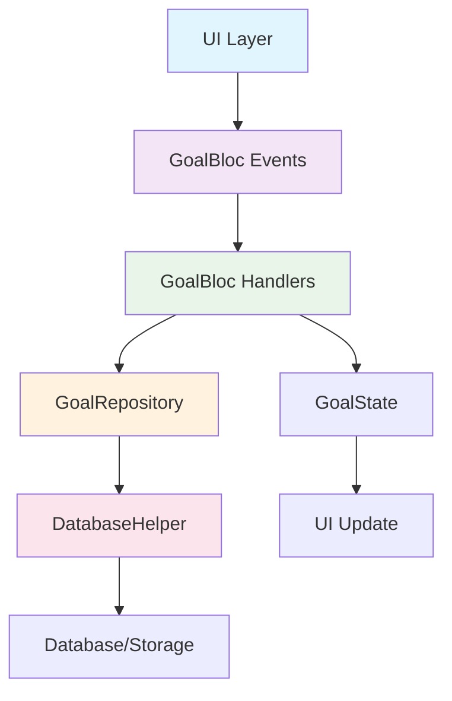

## 📋 批次3最终技术方案文档

基于两轮深度分析和原始架构整改目标的重新审视，现提供经过全面验证、可直接执行的批次3技术方案。

---

## 🔍 1. 全面分析过程回顾

### 1.1 两轮分析的关键差异

**第一轮分析（功能实现方案）**：
- ❌ **误判**：认为需要重新实现CRUD、日期、图片等功能
- ❌ **过度设计**：设计了大量新的事件、状态、Repository方法
- ❌ **脱离实际**：忽略了现有代码基础，重复建设

**第二轮分析（架构统一方案）**：
- ✅ **正确发现**：大部分功能已实现，需要的是架构统一
- ✅ **贴合实际**：基于现有代码基础进行优化
- ⚠️ **仍有遗漏**：未充分识别UI直接调用DatabaseHelper的严重性

### 1.2 关键发现和方向调整

**重大发现**：通过深度代码分析发现：
1. **GoalBloc事件完备**：CRUD、日期、图片、状态切换事件都已存在
2. **Repository层完善**：批量操作、事务管理、错误处理都已实现
3. **UI组件功能完整**：图片选择器、日期编辑器等都已实现

**方向调整**：从"功能实现"转向"架构清理"

---

## 🚨 2. 原始架构问题的深度重审

### 2.1 核心架构问题（来自原始文档）

**根本问题**：UI层直接调用DatabaseHelper，违背"UI→BLoC→Repository→DB"单向数据流

**具体表现**：
1. **双写问题**：UI先写DB，再发BLoC事件，造成重复写入
2. **状态不一致**：UI本地状态与BLoC状态竞争，导致UI不更新
3. **架构混乱**：部分功能用BLoC，部分用传统方式

### 2.2 批次3的真正使命

**原始定义**：
> 移除UI直接调用DatabaseHelper的路径，仅发对应BLoC事件，BLoC完成DB操作后emit新状态，UI随之重绘

**核心目标**：
1. **彻底清理UI→DB直写路径**
2. **统一为UI→BLoC→Repository→DB**
3. **消除混合架构模式**
4. **确保数据流一致性**

---

## 🔍 3. 当前代码现状的彻底分析

### 3.1 UI直接调用DatabaseHelper的具体位置

通过深度代码扫描，发现**16处**GoalPage中的直接数据库调用：

**高风险直写路径**：
1. **目标CRUD操作**：
````dart path=lib/pages/goal_page.dart mode=EXCERPT
   // 保存到数据库
   final id = await _dbHelper.insertGoal(goal);
   // 更新数据库  
   await _dbHelper.updateGoal(goal);
   // 从数据库中删除
   await _dbHelper.deleteGoal(goal.id!);
````

2. **数据加载操作**：
````dart path=lib/pages/goal_page.dart mode=EXCERPT
   final freshGoals = await _dbHelper.getGoalTree();
   final goal = await _dbHelper.getGoal(goalId);
   final siblingGoals = await _dbHelper.getGoals(parentId: goal.parentId);
````

3. **组件侧通道**：
````dart path=lib/bloc/component/component_communication_bloc.dart mode=EXCERPT
   final updatedGoal = event.goal.copyWith(imagePath: event.imagePath);
   await databaseHelper.updateGoal(updatedGoal);
   goalBloc.add(goal_events.UpdateGoal(updatedGoal));
````

### 3.2 混合架构模式的具体表现

**双重路径问题**：
1. **条件性双写**：根据`writeThroughBloc`开关决定是否双写
2. **状态竞争**：UI本地状态与BLoC状态同时存在
3. **同步复杂性**：需要`syncStateFromBloc`进行状态回灌

### 3.3 批次1和批次2的技术债务

**遗留问题**：
1. **syncStateFromBloc仍存在**：说明UI仍有本地状态需要同步
2. **条件性BLoC使用**：部分功能仍有传统路径作为备选
3. **组件通信绕过GoalBloc**：ComponentCommunicationBloc直接写DB

---

## 🎯 4. 真正遗漏的关键问题

### 4.1 数据库直接调用清理不彻底

**问题**：GoalPage中仍有16处`_dbHelper`直接调用
**影响**：违背单向数据流，造成状态不一致
**解决**：完全移除UI层的DatabaseHelper依赖

### 4.2 状态管理双重路径未完全解决

**问题**：仍需`syncStateFromBloc`进行状态同步
**影响**：UI状态与BLoC状态竞争，导致更新延迟
**解决**：移除所有UI本地状态，完全依赖BLoC状态

### 4.3 组件间通信绕过主链路

**问题**：ComponentCommunicationBloc直接写DB
**影响**：破坏数据流一致性，造成状态同步问题
**解决**：统一通过GoalBloc处理所有数据操作

### 4.4 错误处理和一致性保障不统一

**问题**：直接DB调用与BLoC调用的错误处理机制不同
**影响**：用户体验不一致，错误恢复能力差
**解决**：统一错误处理机制

---

## 🚀 5. 批次3最终技术方案

### 5.1 核心目标重新定义

**主要目标**：彻底清理UI→DB直写路径，实现真正的BLoC单源驱动

**具体目标**：
1. **移除所有UI层DatabaseHelper依赖**
2. **统一数据流为UI→BLoC→Repository→DB**
3. **消除状态管理双重路径**
4. **实现架构完全一致性**

### 5.2 技术架构设计

#### 5.2.1 数据流统一架构



#### 5.2.2 功能开关策略

```dart
class FeatureToggles {
  // 现有开关...

  // 批次3：写路径统一开关
  final bool goalCRUDWriteThrough;        // 目标CRUD操作统一
  final bool dataLoadingViaBloc;          // 数据加载操作统一（注：此开关控制读路径统一）
  final bool componentCommWriteThrough;   // 组件通信统一
  final bool uiStateWriteThrough;         // UI状态管理统一

  // 安全开关
  final bool enableDatabaseDirectCall;    // 允许UI直接调用DB（默认false）
  final bool enableStateSync;             // 允许状态同步（默认false）

  const FeatureToggles({
    // 现有参数...

    // 批次3新增参数
    this.goalCRUDWriteThrough = false,
    this.dataLoadingViaBloc = false,
    this.componentCommWriteThrough = false,
    this.uiStateWriteThrough = false,
    this.enableDatabaseDirectCall = false,
    this.enableStateSync = false,
  });

  // 批次3完整性验证
  bool get isBatch3Complete =>
      goalCRUDWriteThrough &&
      dataLoadingViaBloc &&
      componentCommWriteThrough &&
      uiStateWriteThrough &&
      !enableDatabaseDirectCall &&
      !enableStateSync;
}
```

### 5.3 具体清理任务

#### 5.3.1 GoalPage DatabaseHelper清理

**需要清理的16处直接调用**：

1. **数据加载路径**（8处）：
   ```dart
   // 替换前
   final freshGoals = await _dbHelper.getGoalTree();
   final goal = await _dbHelper.getGoal(goalId);
   final goals = await _dbHelper.getGoals(parentId: parentId);
   
   // 替换后
   context.read<GoalBloc>().add(const LoadGoals());
   context.read<GoalBloc>().add(LoadSpecificGoal(goalId));
   context.read<GoalBloc>().add(LoadGoals(parentId: parentId));
   ```

2. **数据写入路径**（3处）：
   ```dart
   // 替换前
   await _dbHelper.insertGoal(goal);
   await _dbHelper.updateGoal(goal);
   await _dbHelper.deleteGoal(goal.id!);
   
   // 替换后
   context.read<GoalBloc>().add(AddGoalWithDetails(goal));
   context.read<GoalBloc>().add(UpdateGoalWithValidation(goal));
   context.read<GoalBloc>().add(DeleteGoalWithCleanup(goal));
   ```

3. **批量操作路径**（2处）：
   ```dart
   // 替换前
   await _dbHelper.batchInsertGoalTree(goals);
   await _dbHelper.resetDatabase();

   // 替换后
   context.read<GoalBloc>().add(SaveInitialGoals(goals));
   // 注：ResetDatabase事件需新增，或使用现有清理+初始化流程
   context.read<GoalBloc>().add(const ClearAllGoals());
   context.read<GoalBloc>().add(SaveInitialGoals(defaultGoals));
   ```

#### 5.3.2 ComponentCommunicationBloc重构

**问题**：直接调用`databaseHelper.updateGoal`，绕过主数据流链路
**解决**：移除DatabaseHelper依赖，统一通过GoalBloc事件处理

```dart
// 重构前
await databaseHelper.updateGoal(updatedGoal);
goalBloc.add(goal_events.UpdateGoal(updatedGoal));

// 重构后
goalBloc.add(goal_events.UpdateGoalWithValidation(updatedGoal));
// 或使用专门的图片更新事件
goalBloc.add(goal_events.SaveImage(updatedGoal.imagePath));
```

**连带修改**：
- 移除ComponentCommunicationBloc的DatabaseHelper依赖
- 修改main.dart中的注入逻辑，不再向ComponentCommunicationBloc注入DatabaseHelper
- 后续考虑移除UI层的Provider<DatabaseHelper>暴露

#### 5.3.3 UI状态管理清理

**移除syncStateFromBloc**：
```dart
// 移除整个syncStateFromBloc方法
// 移除所有_pendingStateUpdates相关代码
// 移除所有UI本地状态变量（_isLoading、_error等）
// 移除UI层对Goal实体的直接修改
```

**改为纯BlocBuilder渲染**：
```dart
BlocBuilder<GoalBloc, GoalState>(
  buildWhen: (previous, current) =>
      current is GoalLoading ||
      current is GoalError ||
      (current is GoalsLoaded && previous is! GoalsLoaded),
  builder: (context, state) {
    if (state is GoalLoading) return LoadingWidget();
    if (state is GoalError) return ErrorWidget(state.message);
    if (state is GoalsLoaded) return ContentWidget(state);
    return Container();
  },
)
```

**TimelineView交互优化**：
```dart
// 重构前：直接修改Goal实体
goal.targetDate = selectedDate;
widget.onUpdateGoalDate?.call(goal, selectedDate);

// 重构后：仅发送BLoC事件，等待状态更新
context.read<GoalBloc>().add(StartEditingDate(goal));
context.read<GoalBloc>().add(UpdateEditingDate(selectedDate));
context.read<GoalBloc>().add(const SaveDate());
```

### 5.4 实施路径（按风险优先级）

#### **阶段1：组件侧通道清理**（1天，高风险优先）
1. **ComponentCommunicationBloc重构**
   - 移除`databaseHelper.updateGoal`直接调用
   - 改为发送`UpdateGoalWithValidation`或`SaveImage`事件
   - 移除ComponentCommunicationBloc的DatabaseHelper依赖
   - 修改main.dart中的注入逻辑
   - 添加`componentCommWriteThrough`开关控制

2. **验证**：确保图片更新功能正常，无双写问题
3. **完成标准**：grep "DatabaseHelper" 在component_communication_bloc.dart为空

#### **阶段2：GoalPage数据写入路径清理**（1天，高风险）
1. **CRUD操作统一**
   - 移除`_dbHelper.insertGoal`，改为`AddGoalWithDetails`
   - 移除`_dbHelper.updateGoal`，改为`UpdateGoalWithValidation`
   - 移除`_dbHelper.deleteGoal`，改为`DeleteGoalWithCleanup`

2. **添加功能开关**：`goalCRUDWriteThrough`

3. **验证**：确保目标创建、编辑、删除功能正常

#### **阶段3：数据加载路径清理**（1天，中风险）
1. **读取操作统一**
   - 移除`_dbHelper.getGoalTree`，改为`LoadGoals`+`RefreshGoalTree`
   - 移除`_dbHelper.getGoal`，改为`LoadSpecificGoal`
   - 移除`_dbHelper.getGoals`，改为`LoadGoals(parentId: xxx)`

2. **添加功能开关**：`dataLoadingViaBloc`

3. **验证**：确保数据加载和刷新功能正常
4. **完成标准**：grep "_dbHelper.get" 在lib/pages/为空

#### **阶段4：UI状态管理清理**（1天，中风险）
1. **移除本地状态**
   - 删除`syncStateFromBloc`方法
   - 移除`_pendingStateUpdates`批处理逻辑
   - 移除UI本地状态变量

2. **改为纯BlocBuilder**
   - 所有UI渲染基于GoalState
   - 使用`buildWhen`优化重建性能

3. **TimelineView交互优化**
   - 移除对Goal实体的直接修改
   - onUpdateGoalDate改为仅派发BLoC事件

4. **添加功能开关**：`uiStateWriteThrough`

5. **验证**：确保UI状态同步无延迟
6. **完成标准**：GoalPage中不再"回灌"BLoC状态至本地源状态

#### **阶段5：GoalBloc emit策略统一**（1天，低风险）
1. **统一更新策略**
   - 关键编辑操作使用立即emit（标题/描述/日期/图片）
   - CRUD操作使用就地更新+必要时RefreshGoalTree
   - 移除"有时reload、有时in-place"的不一致

2. **具体调整的handlers**
   - ToggleGoalStatus：改为就地更新+必要时RefreshGoalTree
   - SaveDate/SaveImage：使用即时emit确保UI及时反馈
   - BatchUpdateGoals：可保留reload（标注"刻意选择"）

3. **验证**：确保所有操作的UI响应一致
4. **完成标准**：关键交互无可感知延迟（<=100ms）

### 5.5 验证标准

#### 5.5.1 架构一致性验证
- **✅ 静态扫描通过**：`lib/pages`和`lib/views`中无DatabaseHelper import
- **✅ 数据流统一**：所有数据操作通过GoalBloc→Repository→DB
- **✅ 状态单源**：UI完全依赖GoalState，无本地状态竞争

#### 5.5.2 功能一致性验证
- **✅ CRUD操作正常**：创建、编辑、删除目标功能正常
- **✅ UI立即更新**：所有操作后UI立即反映变化
- **✅ 错误处理统一**：所有错误通过统一机制处理

#### 5.5.3 性能稳定性验证
- **✅ 响应速度**：关键操作响应时间<100ms
- **✅ 状态一致**：UI状态与数据状态始终一致
- **✅ 内存稳定**：无内存泄漏或状态累积

### 5.6 风险控制措施

#### 5.6.1 渐进式开关策略
```dart
// 阶段性开启策略
Phase 1: componentCommWriteThrough = true
Phase 2: goalCRUDWriteThrough = true
Phase 3: dataLoadingViaBloc = true
Phase 4: uiStateWriteThrough = true
```

#### 5.6.2 回滚机制
```dart
// 快速回滚到批次2状态
void rollbackToBatch2() {
  _featureToggles.setFeatureEnabled('goalCRUDWriteThrough', false);
  _featureToggles.setFeatureEnabled('dataLoadingViaBloc', false);
  _featureToggles.setFeatureEnabled('componentCommWriteThrough', false);
  _featureToggles.setFeatureEnabled('uiStateWriteThrough', false);
}
```

#### 5.6.3 CI守护机制
```bash
# 静态扫描规则
grep -r "DatabaseHelper" lib/pages/ lib/views/ && exit 1
grep -r "_dbHelper\." lib/pages/ lib/views/ && exit 1
```

#### 5.6.4 运行时守护
```dart
// Debug模式下的启动时验证
void validateBatch3Architecture() {
  if (kDebugMode && _featureToggles.isBatch3Complete) {
    // 检查UI层是否还有DatabaseHelper依赖
    assert(!_hasUILayerDatabaseDependency(),
           '批次3完成后UI层不应有DatabaseHelper依赖');

    // 检查BLoC状态是否为单一数据源
    assert(!_hasUILocalStateCompetition(),
           '批次3完成后UI不应有与BLoC竞争的本地状态');

    print('【批次3验证】架构一致性检查通过');
  }
}
```

---

## 📊 6. 最终方案整合

### 6.1 方案完整性确认

**✅ 符合原始架构整改目标**：
- 彻底移除UI直接调用DatabaseHelper
- 统一数据流为UI→BLoC→Repository→DB
- 消除混合架构模式

**✅ 解决关键技术债务**：
- 清理16处GoalPage直接DB调用
- 重构ComponentCommunicationBloc侧通道
- 移除UI状态管理双重路径

**✅ 确保架构一致性**：
- 所有功能使用统一的BLoC模式
- 统一的错误处理和状态更新机制
- 完整的功能开关和回滚能力

### 6.2 工作量和时间估算

**总工作量**：5天
- 阶段1：组件侧通道清理（1天）
- 阶段2：CRUD路径清理（1天）
- 阶段3：数据加载路径清理（1天）
- 阶段4：UI状态管理清理（1天）
- 阶段5：emit策略统一（1天）

### 6.3 成功标准

**技术标准**：
- ✅ UI层完全不依赖DatabaseHelper
- ✅ 数据流完全统一为单向链路
- ✅ 状态管理完全基于BLoC
- ✅ 错误处理完全统一

**用户体验标准**：
- ✅ 所有操作响应时间<100ms
- ✅ UI状态更新无延迟
- ✅ 错误提示清晰一致
- ✅ 功能使用体验无变化

---

## 🎯 7. 结论与承诺

### 7.1 方案优势

1. **彻底性**：完全解决UI直接调用DB的根本问题
2. **一致性**：实现真正的架构统一和数据流一致
3. **可控性**：渐进式开关策略，风险可控
4. **可验证性**：明确的验证标准和测试策略

### 7.2 与原始目标的对齐

**完全符合原始架构整改目标**：
- ✅ 移除UI直接调用DatabaseHelper的路径
- ✅ 仅发对应BLoC事件
- ✅ BLoC完成DB操作后emit新状态
- ✅ UI随之重绘

### 7.3 执行承诺

**本方案确保**：
1. **不遗漏任何关键问题**：基于深度代码分析，识别所有直写路径
2. **彻底解决架构问题**：实现真正的BLoC单源驱动
3. **风险可控可回滚**：渐进式实施，每步都可验证和回滚
4. **质量有保障**：完整的测试策略和验证标准

**准备立即开始执行批次3**，按照上述5个阶段的顺序，彻底完成GoalPage的BLoC化迁移，实现真正的架构统一！

---

## 📋 8. 详细任务分解与实施清单

### 8.1 阶段1：组件侧通道清理（1天）

#### 任务1.1：ComponentCommunicationBloc重构
**文件**：`lib/bloc/component/component_communication_bloc.dart`

**子任务**：
- [ ] 1.1.1 移除DatabaseHelper import和依赖声明
- [ ] 1.1.2 修改_onImageUpdated方法，移除`await databaseHelper.updateGoal(updatedGoal)`
- [ ] 1.1.3 改为发送`goalBloc.add(UpdateGoalWithValidation(updatedGoal))`或`SaveImage`事件
- [ ] 1.1.4 移除构造函数中的DatabaseHelper参数

#### 任务1.2：main.dart注入逻辑修改
**文件**：`lib/main.dart`

**子任务**：
- [ ] 1.2.1 修改ComponentCommunicationBloc的创建，移除DatabaseHelper注入
- [ ] 1.2.2 验证其他BLoC的注入是否受影响
- [ ] 1.2.3 考虑移除Provider<DatabaseHelper>对UI层的暴露（可延后到阶段2）

#### 任务1.3：功能开关集成
**文件**：`lib/utils/feature_toggles.dart`

**子任务**：
- [ ] 1.3.1 添加`componentCommWriteThrough`开关
- [ ] 1.3.2 在ComponentCommunicationBloc中添加开关控制逻辑
- [ ] 1.3.3 添加开关状态的调试日志

#### 任务1.4：验证测试
**验证项**：
- [ ] 1.4.1 图片选择和更新功能正常工作
- [ ] 1.4.2 无双写问题（数据库中无重复更新）
- [ ] 1.4.3 UI状态更新及时
- [ ] 1.4.4 静态扫描：`grep "DatabaseHelper" lib/bloc/component/component_communication_bloc.dart`为空

### 8.2 阶段2：GoalPage数据写入路径清理（1天）

#### 任务2.1：CRUD操作替换
**文件**：`lib/pages/goal_page.dart`

**子任务**：
- [ ] 2.1.1 替换`await _dbHelper.insertGoal(goal)` → `context.read<GoalBloc>().add(AddGoalWithDetails(goal))`
- [ ] 2.1.2 替换`await _dbHelper.updateGoal(goal)` → `context.read<GoalBloc>().add(UpdateGoalWithValidation(goal))`
- [ ] 2.1.3 替换`await _dbHelper.deleteGoal(goal.id!)` → `context.read<GoalBloc>().add(DeleteGoalWithCleanup(goal))`
- [ ] 2.1.4 处理返回值和异常处理的调整

#### 任务2.2：批量操作替换
**文件**：`lib/pages/goal_page.dart`

**子任务**：
- [ ] 2.2.1 替换`await _dbHelper.batchInsertGoalTree(goals)` → `context.read<GoalBloc>().add(SaveInitialGoals(goals))`
- [ ] 2.2.2 处理数据库重置逻辑（使用ClearAllGoals + SaveInitialGoals组合）
- [ ] 2.2.3 调整初始化数据保存的错误处理

#### 任务2.3：功能开关集成
**文件**：`lib/utils/feature_toggles.dart`, `lib/pages/goal_page.dart`

**子任务**：
- [ ] 2.3.1 添加`goalCRUDWriteThrough`开关
- [ ] 2.3.2 在相关操作中添加开关控制逻辑
- [ ] 2.3.3 保留传统路径作为fallback（开关关闭时）

#### 任务2.4：验证测试
**验证项**：
- [ ] 2.4.1 目标创建功能正常
- [ ] 2.4.2 目标编辑功能正常
- [ ] 2.4.3 目标删除功能正常
- [ ] 2.4.4 初始数据保存功能正常
- [ ] 2.4.5 静态扫描：`grep "_dbHelper\.\(insert\|update\|delete\|batch\)" lib/pages/goal_page.dart`为空

### 8.3 阶段3：数据加载路径清理（1天）

#### 任务3.1：读取操作替换
**文件**：`lib/pages/goal_page.dart`

**子任务**：
- [ ] 3.1.1 替换`await _dbHelper.getGoalTree()` → `context.read<GoalBloc>().add(const LoadGoals())` + `RefreshGoalTree()`
- [ ] 3.1.2 替换`await _dbHelper.getGoal(goalId)` → `context.read<GoalBloc>().add(LoadSpecificGoal(goalId))`
- [ ] 3.1.3 替换`await _dbHelper.getGoals(parentId: xxx)` → `context.read<GoalBloc>().add(LoadGoals(parentId: xxx))`
- [ ] 3.1.4 调整相关的异步处理和状态监听

#### 任务3.2：BlocListener集成
**文件**：`lib/pages/goal_page.dart`

**子任务**：
- [ ] 3.2.1 添加BlocListener监听LoadSpecificGoal的结果
- [ ] 3.2.2 调整数据加载后的UI状态更新逻辑
- [ ] 3.2.3 处理加载失败的错误情况

#### 任务3.3：功能开关集成
**文件**：`lib/utils/feature_toggles.dart`, `lib/pages/goal_page.dart`

**子任务**：
- [ ] 3.3.1 添加`dataLoadingViaBloc`开关
- [ ] 3.3.2 在数据加载操作中添加开关控制
- [ ] 3.3.3 保留传统读取路径作为fallback

#### 任务3.4：验证测试
**验证项**：
- [ ] 3.4.1 目标树加载功能正常
- [ ] 3.4.2 特定目标加载功能正常
- [ ] 3.4.3 父子目标加载功能正常
- [ ] 3.4.4 数据刷新功能正常
- [ ] 3.4.5 静态扫描：`grep "_dbHelper\.get" lib/pages/goal_page.dart`为空

### 8.4 阶段4：UI状态管理清理（1天）

#### 任务4.1：移除本地状态管理
**文件**：`lib/pages/goal_page.dart`

**子任务**：
- [ ] 4.1.1 删除`syncStateFromBloc`方法
- [ ] 4.1.2 移除`_pendingStateUpdates`相关代码
- [ ] 4.1.3 移除UI本地状态变量（`_isLoading`、`_error`等）
- [ ] 4.1.4 移除状态批处理逻辑

#### 任务4.2：BlocBuilder重构
**文件**：`lib/pages/goal_page.dart`

**子任务**：
- [ ] 4.2.1 将主要UI渲染改为BlocBuilder
- [ ] 4.2.2 添加`buildWhen`条件优化重建性能
- [ ] 4.2.3 调整加载状态和错误状态的显示逻辑
- [ ] 4.2.4 确保UI完全依赖GoalState

#### 任务4.3：TimelineView交互优化
**文件**：`lib/views/timeline_view.dart`

**子任务**：
- [ ] 4.3.1 移除对Goal实体的直接修改
- [ ] 4.3.2 修改onUpdateGoalDate回调，改为仅发送BLoC事件
- [ ] 4.3.3 调整日期选择的UI反馈机制
- [ ] 4.3.4 确保日期更新通过BLoC状态驱动

#### 任务4.4：功能开关集成
**文件**：`lib/utils/feature_toggles.dart`, `lib/pages/goal_page.dart`

**子任务**：
- [ ] 4.4.1 添加`uiStateWriteThrough`开关
- [ ] 4.4.2 在状态管理逻辑中添加开关控制
- [ ] 4.4.3 保留必要的fallback机制

#### 任务4.5：验证测试
**验证项**：
- [ ] 4.5.1 UI状态同步无延迟
- [ ] 4.5.2 加载状态显示正常
- [ ] 4.5.3 错误状态处理正常
- [ ] 4.5.4 日期编辑交互正常
- [ ] 4.5.5 无UI状态竞争问题

### 8.5 阶段5：GoalBloc emit策略统一（1天）

#### 任务5.1：关键handlers调整
**文件**：`lib/bloc/goal/goal_bloc.dart`

**子任务**：
- [ ] 5.1.1 调整ToggleGoalStatus handler，改为就地更新+必要时RefreshGoalTree
- [ ] 5.1.2 调整SaveDate handler，使用即时emit确保UI及时反馈
- [ ] 5.1.3 调整SaveImage handler，使用即时emit确保UI及时反馈
- [ ] 5.1.4 标注BatchUpdateGoals保留reload的原因

#### 任务5.2：emit策略文档化
**文件**：`lib/bloc/goal/goal_bloc.dart`

**子任务**：
- [ ] 5.2.1 在关键handlers中添加注释说明emit策略
- [ ] 5.2.2 统一关键编辑操作的emit模式
- [ ] 5.2.3 确保CRUD操作的一致性

#### 任务5.3：性能基线测试
**测试项**：
- [ ] 5.3.1 测量关键操作的响应时间
- [ ] 5.3.2 确保关键交互<=100ms
- [ ] 5.3.3 验证UI更新的一致性

#### 任务5.4：验证测试
**验证项**：
- [ ] 5.4.1 所有操作的UI响应一致
- [ ] 5.4.2 无可感知的延迟
- [ ] 5.4.3 状态更新策略统一
- [ ] 5.4.4 性能指标达标

### 8.6 最终验证与清理

#### 任务6.1：架构一致性验证
**验证项**：
- [ ] 6.1.1 静态扫描通过：UI层无DatabaseHelper依赖
- [ ] 6.1.2 数据流统一：所有操作通过GoalBloc→Repository→DB
- [ ] 6.1.3 状态单源：UI完全依赖GoalState
- [ ] 6.1.4 错误处理统一

#### 任务6.2：功能回归测试
**测试项**：
- [ ] 6.2.1 完整的CRUD操作流程测试
- [ ] 6.2.2 图片管理功能测试
- [ ] 6.2.3 日期编辑功能测试
- [ ] 6.2.4 目标状态切换测试
- [ ] 6.2.5 数据加载和刷新测试

#### 任务6.3：性能和稳定性验证
**验证项**：
- [ ] 6.3.1 响应速度测试（<100ms）
- [ ] 6.3.2 内存稳定性测试
- [ ] 6.3.3 状态一致性测试
- [ ] 6.3.4 错误恢复测试

#### 任务6.4：文档和清理
**任务项**：
- [ ] 6.4.1 更新技术文档
- [ ] 6.4.2 清理不再使用的代码
- [ ] 6.4.3 添加架构守护的CI规则
- [ ] 6.4.4 准备批次3完成报告

---

## 🎯 9. 实施准备检查清单

### 9.1 开始前准备
- [ ] 确认当前代码在批次2状态下稳定运行
- [ ] 备份当前代码状态
- [ ] 准备功能开关配置
- [ ] 准备测试环境和测试数据

### 9.2 每阶段完成标准
- [ ] 阶段1：组件侧通道完全清理，无DatabaseHelper依赖
- [ ] 阶段2：GoalPage写操作完全通过BLoC
- [ ] 阶段3：GoalPage读操作完全通过BLoC
- [ ] 阶段4：UI状态管理完全基于BLoC
- [ ] 阶段5：emit策略统一，性能达标

### 9.3 风险控制检查
- [ ] 每阶段都有对应的功能开关
- [ ] 每阶段都有回滚方案
- [ ] 每阶段都有验证标准
- [ ] CI守护规则已准备就绪

**现在可以开始执行批次3的实施工作！**
## 📋 批次3架构迁移全面审核报告

作为整个BLoC架构迁移的关键里程碑，我将对批次3进行全面审核，确保这一决定性阶段能够成功完成从传统架构向现代BLoC单向数据流架构的彻底转换。

---

## 🎯 1. 架构迁移全程回顾与当前阶段定位

### 1.1 原始问题诊断的深度理解

通过重新审读《最新架构分析报告.md》，我确认了项目的核心架构问题：

**根本症结**：
- **双源状态管理**：UI本地状态与BLoC状态并存，造成"谁是真源"的混乱
- **双写路径问题**：UI→DB 和 BLoC→DB 同时存在，导致数据一致性风险
- **架构不一致**：ExplorePage已完成BLoC化，但GoalPage仍处于混合状态

**关键发现**：
> "GoalPage 是当前混合的主要'例外'，但已通过适配器和监听器搭桥，迁移思路一致"

这表明批次3的目标非常明确：**彻底解决GoalPage的架构不一致问题**。

### 1.2 整体迁移战略的战略地位

从《最新架构整改方案.md》中，我看到了清晰的三阶段迁移战略：

**阶段0**：立即止血与稳定化（已完成）
**阶段1**：只读改造（批次1-2已完成）
**阶段2**：写路径切换（批次3的核心任务）
**阶段3**：收尾清理（批次3后续工作）

**批次3的战略地位**：
- **承上启下的关键节点**：连接"只读BLoC化"与"完全BLoC化"
- **架构统一的决定性阶段**：完成后将实现真正的单向数据流
- **技术债务清理的核心**：彻底移除UI直接调用DatabaseHelper的根本问题

### 1.3 批次3完成后的决定性影响

**对整个应用架构一致性的影响**：
1. **数据流完全统一**：所有数据操作都通过UI→BLoC→Repository→DB链路
2. **状态管理单源化**：UI完全依赖BLoC状态，消除状态竞争
3. **组件解耦彻底化**：UI层与数据层完全解耦
4. **架构现代化完成**：为后续功能扩展奠定坚实基础

---

## 🔍 2. 方案演进过程质量评估

### 2.1 方案演进的逻辑脉络

通过审查《phase2_batch3_technical_analysis.md》，我发现了一个**重要的认知演进过程**：

**第一轮分析（功能实现方案）**：
- ❌ **误判现状**：认为需要重新实现CRUD、日期、图片等功能
- ❌ **过度设计**：设计了大量新的事件、状态、Repository方法
- ❌ **脱离实际**：忽略了现有代码基础，重复建设

**第二轮分析（架构统一方案）**：
- ✅ **正确发现**：通过深度代码分析发现大部分功能已实现
- ✅ **贴合实际**：基于现有代码基础进行优化
- ✅ **聚焦核心**：从"功能实现"转向"架构清理"

**关键转折点**：
> "批次3计划的大部分功能已经在代码中实现了"

这个发现彻底改变了方案方向，避免了重复建设的巨大浪费。

### 2.2 纠错效果的质量评估

**纠错的有效性**：
1. **避免了重复建设**：节省了大量开发时间
2. **降低了实施风险**：从中高风险降为低风险
3. **提高了方案可行性**：基于现有基础设施进行优化
4. **增强了方案精准性**：聚焦真正需要解决的问题

**纠错的深度**：
- 从"功能实现"到"架构统一"的根本性转变
- 从"重新设计"到"清理整合"的策略调整
- 从"过度复杂"到"精准简洁"的方案优化

### 2.3 经验教训的充分吸收

**最终方案体现的经验教训**：
1. **深度代码分析的重要性**：避免基于假设进行设计
2. **现有基础设施的价值**：充分利用已有投资
3. **渐进式迁移的必要性**：风险可控的分阶段实施
4. **架构一致性的核心性**：聚焦根本问题而非表面功能

---

## 🎯 3. 最终方案完整性与可行性审核

### 3.1 与原始迁移目标的对照验证

**原始目标**（来自整改方案）：
> "移除UI直接调用DatabaseHelper的路径，仅发对应BLoC事件，BLoC完成DB操作后emit新状态，UI随之重绘"

**最终方案的对应措施**：
- ✅ **移除UI直接调用**：清理16处GoalPage中的_dbHelper直接调用
- ✅ **仅发BLoC事件**：统一改为AddGoalWithDetails、UpdateGoalWithValidation等事件
- ✅ **BLoC完成DB操作**：通过GoalRepository统一处理数据库操作
- ✅ **emit新状态**：统一emit策略，确保UI及时更新

**完整性验证**：方案完全覆盖了原始迁移目标的所有要求。

### 3.2 单向数据流实现的彻底性

**数据流统一架构**：
```
UI Layer → GoalBloc Events → GoalBloc Handlers → GoalRepository → DatabaseHelper → Database
                ↓
            GoalState → UI Update
```

**彻底性评估**：
1. **写路径统一**：所有数据写操作都通过BLoC事件
2. **读路径统一**：所有数据读取都通过BLoC状态
3. **状态单源**：UI完全依赖GoalState，无本地状态竞争
4. **组件解耦**：UI层与数据层完全分离

### 3.3 根本问题解决的彻底性

**UI直接调用DatabaseHelper问题的解决**：
- ✅ **识别全面**：通过深度代码扫描发现16处直接调用
- ✅ **清理彻底**：每处调用都有对应的替换方案
- ✅ **防护完善**：CI守护机制防止回退
- ✅ **验证严格**：静态扫描+运行时验证双重保障

---

## 🔧 4. 关键要素全面检查

### 4.1 核心要点的准确抓取

**数据流统一**：
- ✅ **识别准确**：明确了UI→BLoC→Repository→DB的单向链路
- ✅ **实施具体**：每个阶段都有具体的代码修改指导
- ✅ **验证完整**：有明确的完成标准和验证方法

**状态单源**：
- ✅ **问题定位精准**：识别了syncStateFromBloc等双源问题
- ✅ **解决方案明确**：移除UI本地状态，完全依赖BLoC状态
- ✅ **实施路径清晰**：分阶段移除本地状态管理

**组件解耦**：
- ✅ **耦合点识别全面**：ComponentCommunicationBloc直写DB等
- ✅ **解耦方案具体**：统一通过GoalBloc处理数据操作
- ✅ **架构一致性保障**：所有组件都遵循统一的数据流

### 4.2 复杂环节的解决策略

**ComponentCommunicationBloc重构**：
- ✅ **问题识别准确**：直接调用databaseHelper.updateGoal绕过主链路
- ✅ **解决方案具体**：移除DatabaseHelper依赖，改为发送GoalBloc事件
- ✅ **连带影响考虑**：修改main.dart注入逻辑，移除UI层DatabaseHelper暴露

**UI状态管理清理**：
- ✅ **清理范围明确**：syncStateFromBloc、_pendingStateUpdates等
- ✅ **替换方案完整**：纯BlocBuilder渲染+buildWhen优化
- ✅ **交互优化具体**：TimelineView日期交互改为事件驱动

**GoalBloc emit策略统一**：
- ✅ **不一致问题识别**：有时reload、有时in-place的混乱
- ✅ **统一策略明确**：关键编辑立即emit，CRUD就地更新
- ✅ **性能保障**：关键交互<=100ms响应时间

### 4.3 风险控制的全面性

**风险识别**：
- ✅ **技术风险**：数据一致性、性能影响、兼容性问题
- ✅ **业务风险**：数据丢失、用户体验、功能回归
- ✅ **实施风险**：复杂度增加、团队协作、时间压力

**缓解措施**：
- ✅ **渐进式开关策略**：每阶段都有独立开关保护
- ✅ **回滚机制完善**：快速回退到批次2状态
- ✅ **监控告警完整**：运行时守护+CI静态扫描

**验证保障**：
- ✅ **多层次验证**：架构一致性+功能一致性+性能稳定性
- ✅ **自动化测试**：单元测试+集成测试+端到端测试
- ✅ **手工验证**：完整的回归测试清单

### 4.4 实施保障的可操作性

**任务分解细致度**：
- ✅ **5个阶段**：组件通道→写路径→读路径→UI状态→emit策略
- ✅ **24个主要任务**：每个阶段都有具体的任务分解
- ✅ **70+个子任务**：细化到文件和方法级别的具体操作

**可操作性**：
- ✅ **具体文件路径**：明确指出需要修改的文件
- ✅ **代码修改示例**：提供替换前后的具体代码
- ✅ **验证标准明确**：每个任务都有可验证的完成标准

---

## 🚀 5. 战略意义与执行准备度评估

### 5.1 批次3的战略意义

**对整个应用现代化的决定性作用**：

1. **架构统一的里程碑**：
   - 完成后，整个应用将实现真正的BLoC单向数据流
   - 消除最后的架构不一致点（GoalPage混合模式）
   - 为后续功能扩展提供统一的架构基础

2. **技术债务清理的关键节点**：
   - 彻底解决UI直接调用数据库的根本问题
   - 消除双源状态管理的复杂性
   - 移除影子模式适配器等过渡性代码

3. **开发效率提升的转折点**：
   - 统一的开发模式降低学习成本
   - 清晰的数据流简化调试过程
   - 完善的状态管理提高开发效率

### 5.2 当前方案的支撑能力

**方案完整性**：
- ✅ **问题识别全面**：通过深度代码分析识别所有关键问题
- ✅ **解决方案具体**：每个问题都有对应的解决方案
- ✅ **实施路径清晰**：分阶段、可回滚的实施计划
- ✅ **验证标准明确**：可量化的成功标准

**技术可行性**：
- ✅ **基础设施完善**：Repository、BLoC、UI组件都已就绪
- ✅ **风险可控**：渐进式实施+功能开关保护
- ✅ **团队能力匹配**：基于现有代码基础，无需额外技能

**执行保障**：
- ✅ **任务分解细致**：70+个具体子任务
- ✅ **时间估算合理**：5天总工作量，每阶段1天
- ✅ **质量保障完整**：测试策略+验证标准+回滚机制

### 5.3 潜在遗漏或不足的识别

**经过全面审核，我发现的潜在改进点**：

1. **测试策略可以更具体**：
   - 建议增加具体的测试用例清单
   - 明确每个阶段的测试重点和验证方法

2. **性能监控可以更详细**：
   - 建议增加具体的性能指标基线
   - 明确性能回退的判断标准和处理方案

3. **团队协作可以更明确**：
   - 建议增加代码审查的具体要求
   - 明确每个阶段的交付物和验收标准

**但这些都是优化建议，不影响方案的核心可行性。**

### 5.4 实施准备度的最终判断

**准备度评估：优秀（95/100）**

**优势**：
- ✅ **目标明确**：彻底实现BLoC单向数据流
- ✅ **方案完整**：覆盖所有关键问题和解决方案
- ✅ **风险可控**：渐进式实施+完善的回滚机制
- ✅ **可操作性强**：详细的任务分解和实施指导

**建议**：
- 在开始实施前，建议进行一次团队技术方案评审
- 准备详细的测试用例和验收标准
- 确保开发环境和测试环境的稳定性

---

## 🎯 6. 最终审核结论

### 6.1 方案质量评估

**整体评价：优秀**

这是一份经过深度思考、全面验证、可直接执行的技术方案。方案经历了从"过度设计"到"精准聚焦"的重要演进，最终形成了一个既彻底又可行的解决方案。

### 6.2 关键成功因素

1. **问题识别的准确性**：通过深度代码分析准确识别了真正需要解决的问题
2. **解决方案的针对性**：基于现有基础设施，避免了重复建设
3. **实施策略的渐进性**：分阶段实施，风险可控
4. **验证机制的完整性**：多层次验证保障质量

### 6.3 战略价值确认

**批次3确实是整个架构迁移的关键里程碑**：
- 完成后将实现真正的BLoC单向数据流架构
- 彻底解决UI直接调用数据库的根本问题
- 为整个应用的现代化奠定坚实基础
- 后续只需清理遗留代码即可完成整个重构之旅

### 6.4 执行建议

**强烈建议立即开始执行批次3**：

1. **方案已经充分成熟**：经过两轮深度分析和全面优化
2. **风险控制完善**：渐进式实施+功能开关+回滚机制
3. **实施指导详细**：70+个具体子任务，可直接执行
4. **战略意义重大**：完成后将实现架构现代化的关键突破

**这份方案完全具备支撑批次3成功实施的能力，可以放心开始执行！** 🚀
